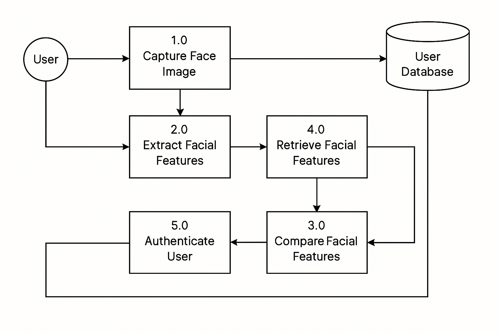

# Face Authentication System

## Overview
The Face Authentication System is a web application built using Streamlit that allows users to register and log in using facial recognition technology. The application captures users' facial images, processes them to generate embeddings, and stores them in a SQLite database for authentication.

## Problem Statement
- Traditional password-based authentication is vulnerable to various attacks like hacking and phishing.
- Users often struggle with remembering or creating strong passwords.
- This project aims to provide a more secure and user-friendly authentication method using biometrics.

## Objectives
- To provide a secure authentication system using **facial recognition**.
- To offer user convenience with easy facial registration and login.
- To securely store user facial data in a **SQLite database**.
- To reduce the risks associated with password breaches.

## How Face Recognition Works

### User Registration
1. Users capture their facial image using a webcam.
2. The system extracts unique facial embeddings from the image.
3. These embeddings are stored in a **SQLite database**.

### User Login
1. Users capture their face again.
2. The system compares the new image with the stored embeddings.
3. Access is granted if a match is found; otherwise, access is denied.

## Benefits
- Enhanced security.
- User-friendly interface.
- Eliminates password management.
- Reduces risks of cyberattacks.

## Limitations
- Requires a camera.
- Accuracy can be affected by lighting and camera quality.
- Privacy concerns regarding facial data storage.

## Local Installation
### GitHub
1. Clone the repository:
   ```bash
   git clone https://github.com/arslaan5/Face-Authentication-System
   cd Face-Authentication-System
   ```

2. Install the required dependencies:
   ```bash
   pip install -r requirements.txt
   ```

3. Run the application:
   ```bash
   streamlit run app.py
   ```
### Docker
*Make sure you have Docker installed on your system!*

1. Pull the Docker image:
   ```bash
   docker pull arslaan5/face-recognition-system:v1.0
   ```

2. Run the Docker container:
   ```bash
   docker run -p 8501:8501 arslaan5/face-recognition-system:v1.0
   ```

3. Access the application in your web browser at `http://localhost:8501`.

## Usage
1. Navigate to the application in your web browser.

2. Register a new user by capturing a clear image of your face and entering your name.

3. Log in using the captured image to authenticate.

## Architecture
- **Frontend**: Built with Streamlit, providing a user-friendly interface for registration and login.
- **Backend**: 
  - **Database**: SQLite for storing user data and face embeddings.
  - **Face Recognition**: Utilizes the `face_recognition` library for detecting and recognizing faces.
  - **Utilities**: Functions for image processing, database interactions, and user management.



## Tools and Technologies
- **Programming Language**: Python.
- **Framework**: Streamlit.
- **Database**: SQLite.
- **Key Libraries**: face_recognition, OpenCV, NumPy.

---

## Contributing
Contributions are welcome! Please open an issue or submit a pull request for any enhancements or bug fixes.

## License
This project is licensed under the MIT License.
